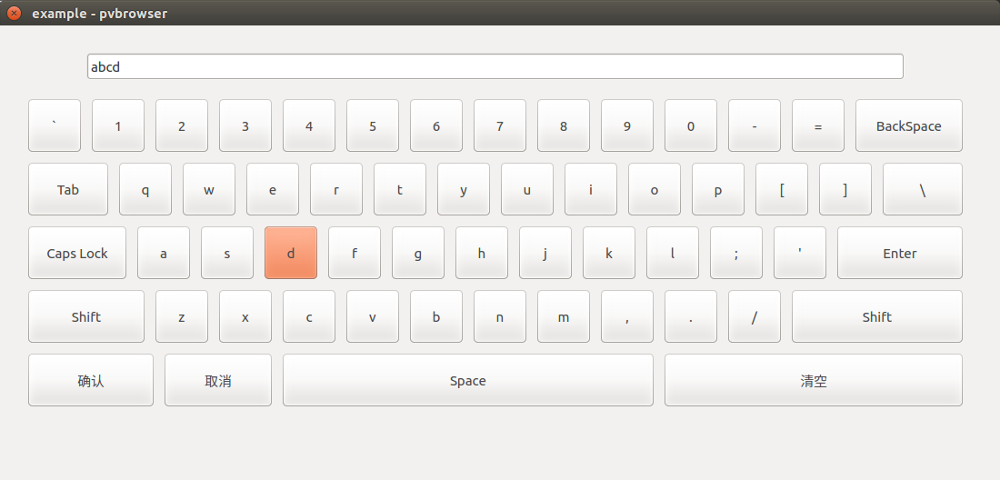

# pvkeyboard
A soft keyboard for pvbrowser.

## Overview
This project is to implement a soft keyboard for pvbrowser, which is very useful for embedded platform with a touch screen.


## Run the example
There is a pvb example project in the `pvexample` folder, if you have pvbrowser installed in your system, you can use this example to test the soft keyboard.
``` bash
cd pvexample
./example &
pvbrowser
```
if this doesn't work, you may need to build it yourself by `make` or `pvdevelop`
``` bash
make clean
make
```

## Usage
The pvkeyboard is implemented by a modal dialog, to add it to your project, you have to download pvkeyboard.h and pvkeyboard.cpp to your project folder, and follow these steps:

1. Add pvkeyboard.h to HEADERS and pvkeyboard.cpp to SOURCES in the `project` file.
	 ``` qt
	HEADERS += pvapp.h      \
			mask1_slots.h \
			...           \
			pvkeyboard.h
	SOURCES += main.cpp     \
			mask1.cpp     \
			...           \
			pvkeyboard.cpp
	```
2. Add declaration of pvkeyboard function into `header` file.
	 ``` cpp
	#include "processviewserver.h"
	// todo: comment me out
	//#include "rlmodbusclient.h"
	//#include "rlsiemenstcpclient.h"
	...
  
	int show_mask1(PARAM *p);      
	...                         //These are generated by pvdevelop.

	int pvkeyboard(PARAM *p);   //You should add this line.
	```
3. Create an array for your LineEdit widget in the 'DATA' structure provided by pvb in the `slot` file.
	 ```cpp
	typedef struct // (todo: define your data structure here)
	{
		char inputdata1[1024];
		char inputdata2[1024];
		//...
	}
	DATA;
	```
	you may need different arrays for different LineEdit widgets.   
	Don't forget to initialize the structure by uncomment the statement in the `slotInit` function
	 ``` c++
	static int slotInit(PARAM *p, DATA *d)
	{
		if(p == NULL || d == NULL) return -1;
		memset(d,0,sizeof(DATA));
		return 0;
	}
	```

4. In the `slot` file, call the dialog to show this keyboard.
	 ``` cpp
	static int slotButtonEvent(PARAM *p, int id, DATA *d)
	{
		if(p == NULL || id == 0 || d == NULL) return -1;
		if(id == 1)
			pvRunModalDialog(p,1100,500,pvkeyboard,d->inputdata1,NULL,NULL,NULL);
		if(id == 2)
			pvRunModalDialog(p,1100,500,pvkeyboard,d->inputdata2,NULL,NULL,NULL);
		return 0;
	}
	```
	the pvRunModalDialog has many parameters, you only need to modify the `userData`(the 5th) parameter to the array corresponding to the LineEdit widget indicated by the `id`.

5. By pressing 'enter' in the soft keyboard, the keyboard dialog will terminate and update the base window by 
slotNullEvent, so you can display the text in slotNullEvent function. 
	 ``` cpp
	static int slotNullEvent(PARAM *p, DATA *d)
	{
		if(p == NULL || d == NULL) return -1;
		pvPrintf(p,1,"%s",d->inputdata1);
		pvPrintf(p,2,"%s",d->inputdata2);
		return 0;
	} 
	```
	where '1' and '2' is the id of your LineEdit widget.    
	If the dialog is closed directly or by the '取消' button, the text edited in the keyboard will not return to the base window.

## Todo
- Add input method for Chinese.
